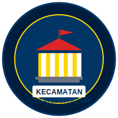

# Website Camat

<p align="center">

</p>

<p align="center">


</p>

## Tentang Website Camat

Website Camat adalah sistem informasi digital yang dirancang khusus untuk melayani masyarakat dalam mengakses berbagai layanan pemerintahan tingkat kecamatan. Aplikasi ini menyediakan platform terintegrasi untuk:

- **Layanan Pengaduan Masyarakat** - Sistem pelaporan dan tracking pengaduan
- **Permohonan Dokumen** - Pengajuan dan monitoring dokumen kependudukan
- **Permohonan Surat** - Layanan pembuatan surat-surat resmi
- **Galeri Kegiatan** - Dokumentasi kegiatan dan program kecamatan
- **Berita & Pengumuman** - Informasi terkini dari pemerintah kecamatan
- **Transparansi Publik** - Akses informasi publik dan data transparansi
- **Sistem Notifikasi Real-time** - Update status layanan secara langsung

## Fitur Utama

### 🏛️ **Dashboard Admin**
- Manajemen pengguna dan role
- Monitoring semua layanan
- Statistik dan laporan
- Pengaturan sistem

### 👥 **Portal Masyarakat**
- Registrasi dan login pengguna
- Pengajuan layanan online
- Tracking status permohonan
- Notifikasi real-time

### 📱 **Responsive Design**
- Optimized untuk desktop dan mobile
- Interface yang user-friendly
- Aksesibilitas yang baik

### 🔔 **Sistem Notifikasi**
- Real-time notifications
- Email notifications
- Push notifications
- Status tracking

## Teknologi yang Digunakan

- **Backend**: Laravel 11.x
- **Frontend**: Blade Templates + Tailwind CSS
- **Database**: MySQL
- **Real-time**: Laravel Echo + Pusher
- **File Storage**: Laravel Storage
- **Authentication**: Laravel Breeze
- **Queue**: Laravel Queue
- **Cache**: Redis (optional)

## Persyaratan Sistem

- PHP 8.2 atau lebih tinggi
- MySQL 8.0 atau MariaDB 10.3+
- Composer
- Node.js dan NPM
- Web Server (Apache/Nginx)

## Instalasi

### 1. Clone Repository
```bash
git clone https://github.com/username/website-camat.git
cd website-camat
```

### 2. Install Dependencies
```bash
# Install PHP dependencies
composer install

# Install Node.js dependencies
npm install
```

### 3. Environment Setup
```bash
# Copy environment file
cp .env.example .env

# Generate application key
php artisan key:generate

# Configure database di file .env
```

### 4. Database Setup
```bash
# Run migrations
php artisan migrate

# Seed initial data
php artisan db:seed --class=RoleSeeder
php artisan db:seed --class=AdminUserSeeder
php artisan db:seed --class=VillageInfoSeeder
```

### 5. Storage Setup
```bash
# Create storage link
php artisan storage:link
```

### 6. Build Assets
```bash
# Development
npm run dev

# Production
npm run build
```

### 7. Run Application
```bash
# Development server
php artisan serve
```

## Deployment

Untuk deployment ke production server, silakan ikuti panduan lengkap di [DEPLOYMENT_GUIDE.md](DEPLOYMENT_GUIDE.md).

### Quick Production Setup
```bash
# Jalankan script optimasi (Linux/Unix)
./optimize-production.sh

# Atau untuk Windows
.\optimize-production.ps1
```

## Konfigurasi

### Environment Variables
Pastikan untuk mengkonfigurasi variabel environment berikut di file `.env`:

```env
# Database
DB_CONNECTION=mysql
DB_HOST=127.0.0.1
DB_PORT=3306
DB_DATABASE=website_camat
DB_USERNAME=your_username
DB_PASSWORD=your_password

# Mail (untuk notifikasi email)
MAIL_MAILER=smtp
MAIL_HOST=your-smtp-host
MAIL_PORT=587
MAIL_USERNAME=your-email
MAIL_PASSWORD=your-password

# Pusher (untuk real-time notifications)
PUSHER_APP_ID=your-app-id
PUSHER_APP_KEY=your-app-key
PUSHER_APP_SECRET=your-app-secret
PUSHER_APP_CLUSTER=your-cluster
```

## Default Login

Setelah menjalankan seeder, gunakan kredensial berikut untuk login admin:

- **Email**: admin@camat.local
- **Password**: password

> ⚠️ **Penting**: Segera ubah password default setelah login pertama!

## Kontribusi

Kami menyambut kontribusi dari developer lain! Silakan:

1. Fork repository ini
2. Buat branch untuk fitur baru (`git checkout -b feature/AmazingFeature`)
3. Commit perubahan (`git commit -m 'Add some AmazingFeature'`)
4. Push ke branch (`git push origin feature/AmazingFeature`)
5. Buat Pull Request

## Lisensi

Proyek ini dilisensikan di bawah [MIT License](LICENSE).

## Support

Jika Anda mengalami masalah atau memiliki pertanyaan, silakan:

1. Buka [Issues](https://github.com/username/website-camat/issues) di GitHub
2. Hubungi tim development
3. Baca dokumentasi di [DEPLOYMENT_GUIDE.md](DEPLOYMENT_GUIDE.md)

---

**Website Camat** - Digitalisasi Pelayanan Publik Kecamatan
